<p align="center">
  <h1 align="center">🛒 TimeStore</h1>
  <p align="center">
    A custom PHP e-commerce platform built with MVC architecture, a front controller, and a custom routing system.
  </p>
</p>

<p align="center">


</p>

---

# 🔗 Project Links

- GitHub Repository: https://github.com/ImeshVishmika/timestore-php
- Live Demo: https://timestore.imeshvishmika.me

---

# 📸 Screenshots

## Admin Panel

[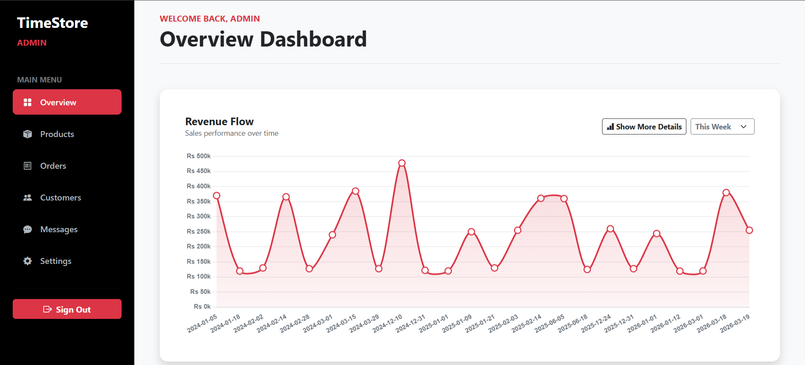](doc/images/admin/AdminDashboard.png)
[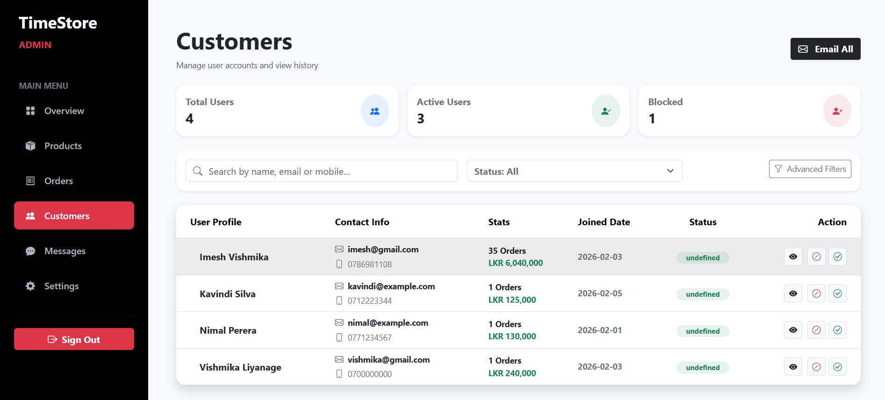](doc/images/admin/customers.png)
[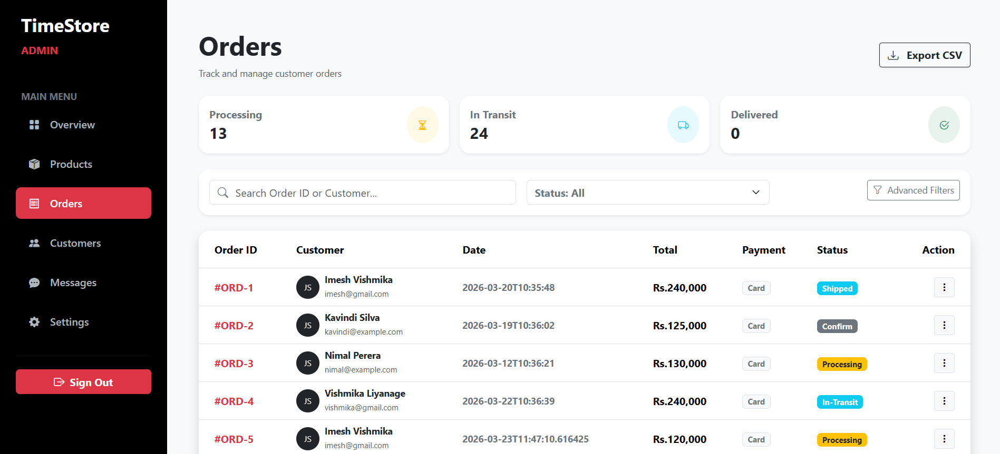](doc/images/admin/orders.png)
[](doc/images/admin/products.png)
[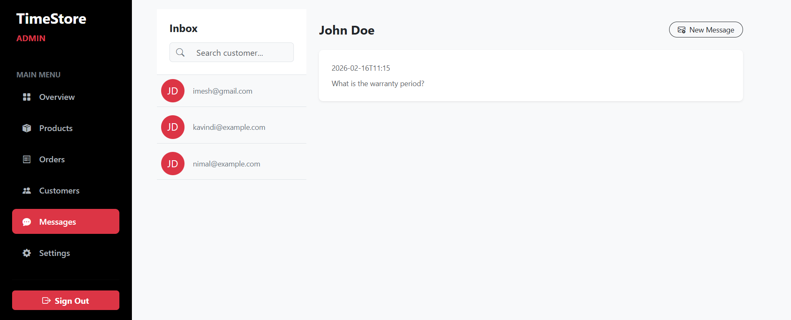](doc/images/admin/messages.png)
[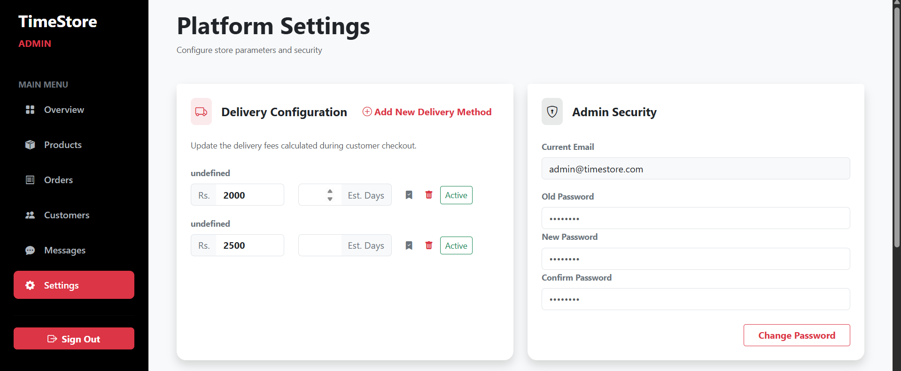](doc/images/admin/settings.png)

## Storefront

[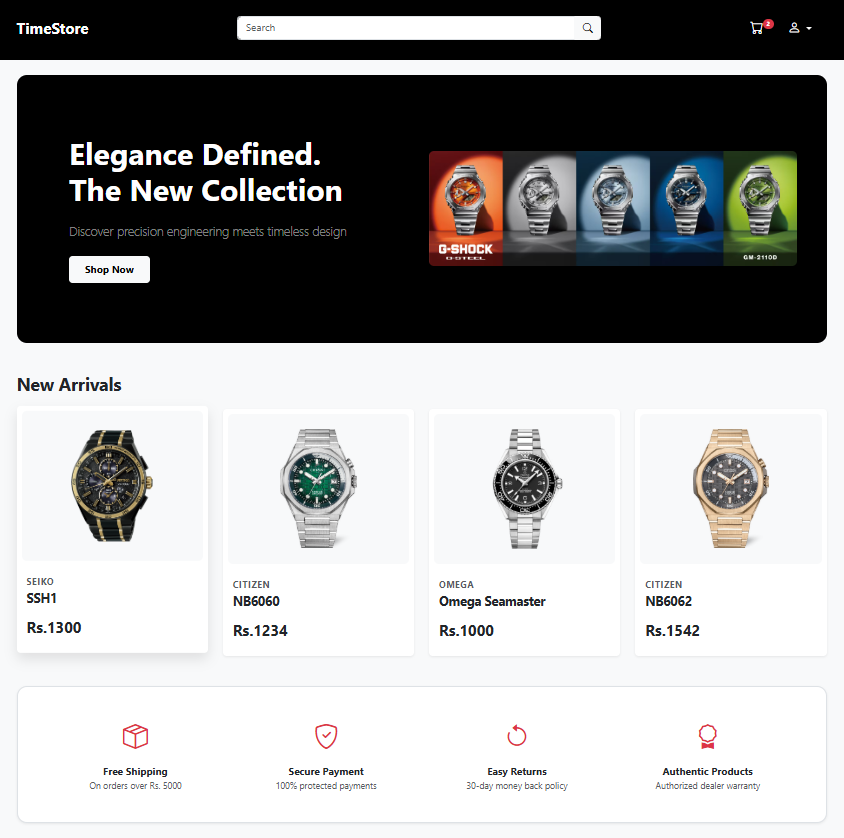](doc/images/user/Home.png)
[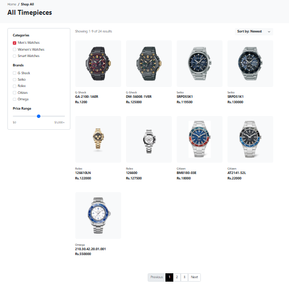](doc/images/user/searchPage.png)
[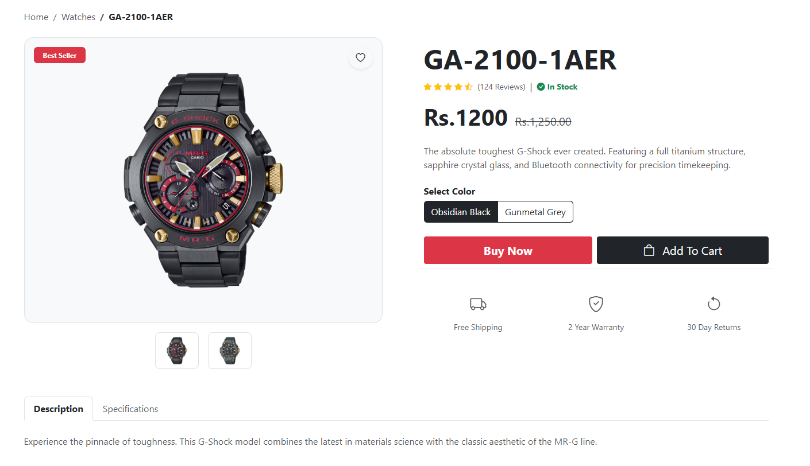](doc/images/user/ProductPage.png)
[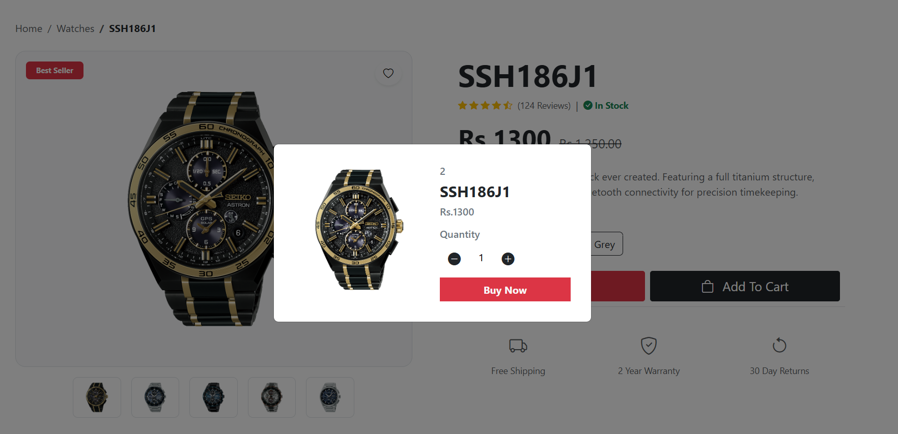](doc/images/user/ProductBuyWindow.png)
[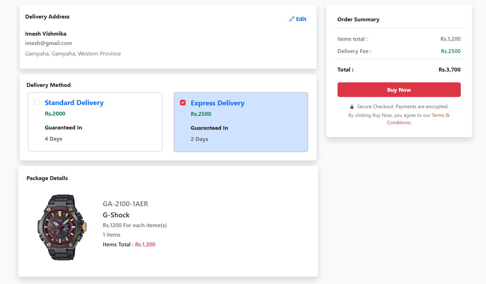](doc/images/user/checkoutPage.png)
[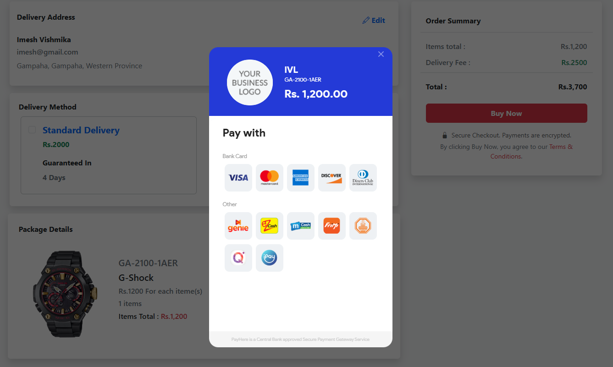](doc/images/user/checkoutPayhereWindow.png)
[](doc/images/user/Payheredetails.png)
[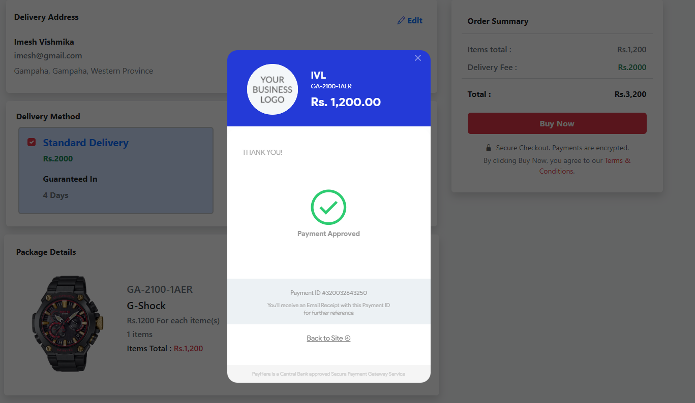](doc/images/user/PaymentSuccessWindow.png)

---

# 📖 Project Overview

**TimeStore** is a PHP-based e-commerce application built around a custom MVC flow with a front controller and route configuration in `Router.php`. The project uses direct controller-to-model access, server-side validation, session-based auth, and a MySQL schema for product, customer, cart, order, and address data.

The application supports storefront browsing, product model management, user accounts, cart and wishlist operations, and admin-side dashboards for product and customer administration. The architecture is intentionally lightweight and code-driven rather than framework-based, which matches the project’s actual implementation and naming patterns.

---

# ⭐ Features

## 👤 User Features

- Browse the product catalog and product variants
- Search products by keyword and filter by product model data
- Add and remove items from the cart
- Save items in a watchlist
- View purchase history and user profile details
- Update personal address information
- Place orders with the **PayHere sandbox payment gateway**
- View and exchange messages with administrators

---

## 🛠 Admin Features

- Add and update product entries and model variants
- Remove products and product records
- View product revenue and sales statistics
- Manage users and customer details
- Review order records and order status
- Manage brand and category records
- Review message activity between users and admins

---

# 🧰 Technology Stack

| Layer | Implementation |
|------|------|
| Backend | PHP 8.x |
| Architecture | MVC with a front controller |
| Routing | Custom route map in `Router.php` |
| Auth | Session-based role checks via middleware |
| Data access | Model classes under `app/model` |
| Database | MySQL |
| Web server | Apache / PHP-FPM |
| Reverse proxy | Nginx |
| Payment | PayHere sandbox |
| Front-end assets | Plain PHP views and static files under `public/assets` |

---

# 🏗 System Architecture

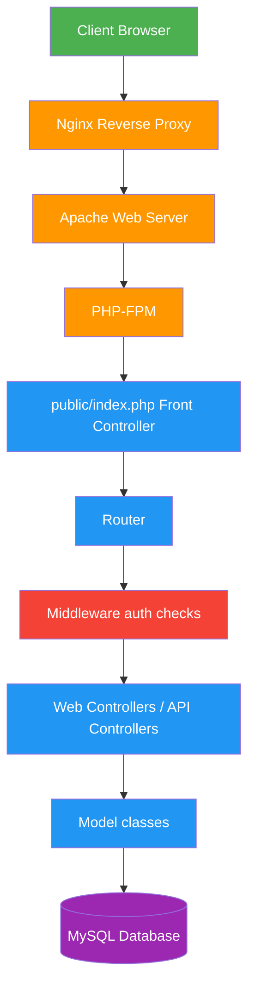
---

# 🔄 Request Lifecycle

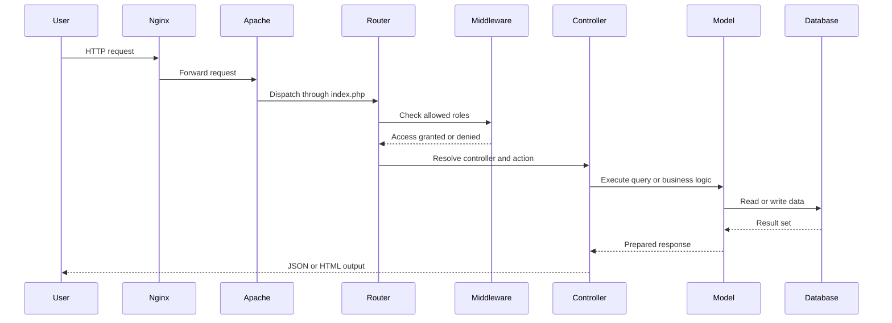
---

# 🗄 Database Design

The database design below reflects the current MySQL schema in `doc/timestore.sql`. It contains 29 base tables and four read-only views: `invoice_data`, `model_data`, `order_data`, and `user_address_data`.

```mermaid
erDiagram
    ADMIN {
        varchar email PK
        varchar password
        varchar first_name
        varchar last_name
    }

    BRAND {
        int brand_id PK
        varchar brand_name
    }

    PRODUCT {
        int product_id PK
        varchar product_name
        int brand_id FK
    }

    PRODUCT_HAS_MODEL {
        int model_id PK
        varchar model
        double price
        int qty
        datetime added_time
        int product_id FK
    }

    GENDER {
        int id PK
        varchar gender
    }

    MODEL {
        int model_id PK
        datetime added_time
        varchar model
        double price
        int product_id FK
        int qty
    }

    CATEGORY {
        int category_id PK
        varchar category_name
    }

    PRODUCT_HAS_CATEGORY {
        int product_id PK,FK
        int category_category_id PK,FK
        int category_id
    }

    PRODUCT_IMG {
        varchar img_path PK
        int model_id FK
    }

    USERS {
        varchar fname
        varchar lname
        varchar password
        varchar mobile
        varchar email PK
        int gender_id FK
        int status FK
        date joined_date
    }

    USER_ADDRESS {
        varchar address_line1
        varchar address_line2
        int address_city_id FK
        varchar users_email PK,FK
    }

    PROVINCES {
        int province_id PK
        varchar name_en
        varchar name_si
        varchar name_ta
    }

    DISTRICTS {
        int district_id PK
        int province_id FK
        varchar district_en
        varchar district_si
        varchar district_ta
    }

    CITIES {
        int city_id PK
        int district_id FK
        varchar city_en
        varchar city_si
        varchar city_ta
        varchar sub_name_en
        varchar sub_name_si
        varchar sub_name_ta
        varchar postcode
        double latitude
        double longitude
    }

    CART {
        int cart_id PK
        int product_id FK
        int cart_qty
        varchar users_email FK
    }

    BUY_NOW_CART {
        varchar user_email FK
        int model_id FK
        int qty
    }

    WATCHLIST {
        int watchlist_id PK
        int product_id FK
        varchar users_email FK
    }

    RATINGS {
        varchar user_email PK,FK
        int product_id PK,FK
        varchar ratings
        varchar comment
    }

    USER_HISTORY {
        int id PK
        varchar user_id FK
        int product_id FK
        datetime buy_datetime
        int amount
    }

    DELIVERY_METHOD {
        int id PK
        varchar delivery_method
        double price
        varchar delivery_days
    }

    ORDER {
        int order_id PK
        varchar email FK
        datetime ordered_date
        int delivery_method FK
        int order_status FK
    }

    ORDER_HAS_MODEL {
        int order_id PK,FK
        int model_id PK,FK
        int qty
    }

    ORDER_STATUS {
        int order_status_id PK
        varchar status
    }

    INVOICE {
        int invoice_id PK
        int order_id
        datetime invoice_date
        varchar email FK
        double delivery_fee
    }

    INVOICE_ITEMS {
        int invoice_item_id PK
        int order_id FK
        int product_id
        varchar product_name
        double product_price
        int qty
        int invoice_id FK
        varchar model_name
        double model_price
        int model_id FK
    }

    MESSAGES {
        int message_id PK
        int status
        text message
        varchar sender FK
        text subject
        timestamp date_time
    }

    MSG_STATUS {
        int msg_status_id PK
        varchar msg_status
    }

    USER_IMG {
        varchar email PK,FK
        text path
    }

    USER_STATUS {
        int status_id PK
        varchar status
    }

    BRAND ||--o{ PRODUCT : contains
    PRODUCT ||--o{ PRODUCT_HAS_MODEL : has
    PRODUCT ||--o{ MODEL : legacy_model
    PRODUCT_HAS_MODEL ||--o{ PRODUCT_HAS_CATEGORY : classified_by
    CATEGORY ||--o{ PRODUCT_HAS_CATEGORY : includes
    PRODUCT_HAS_MODEL ||--o{ PRODUCT_IMG : has
    GENDER ||--o{ USERS : defines
    USERS ||--o{ CART : owns
    PRODUCT_HAS_MODEL ||--o{ CART : added_to
    USERS ||--o{ BUY_NOW_CART : buys_now
    PRODUCT_HAS_MODEL ||--o{ BUY_NOW_CART : selected
    USERS ||--o{ WATCHLIST : saves
    PRODUCT_HAS_MODEL ||--o{ WATCHLIST : watched
    USERS ||--o{ RATINGS : leaves
    PRODUCT_HAS_MODEL ||--o{ RATINGS : rated
    USERS ||--o| USER_ADDRESS : has
    CITIES ||--o{ USER_ADDRESS : contains
    PROVINCES ||--o{ DISTRICTS : contains
    DISTRICTS ||--o{ CITIES : contains
    USERS ||--o{ USER_HISTORY : purchases
    PRODUCT_HAS_MODEL ||--o{ USER_HISTORY : purchased_as
    USERS ||--o{ ORDER : places
    DELIVERY_METHOD ||--o{ ORDER : uses
    ORDER_STATUS ||--o{ ORDER : tracks
    ORDER ||--o{ ORDER_HAS_MODEL : contains
    PRODUCT_HAS_MODEL ||--o{ ORDER_HAS_MODEL : ordered
    USERS ||--o{ INVOICE : billed
    ORDER ||--o{ INVOICE_ITEMS : referenced_by
    INVOICE ||--o{ INVOICE_ITEMS : contains
    PRODUCT_HAS_MODEL ||--o{ INVOICE_ITEMS : invoiced
    USERS ||--o{ MESSAGES : sends
    USERS ||--o| USER_IMG : has
    USER_STATUS ||--o{ USERS : controls
```

Core schema tables:

- Catalog: `brand`, `product`, `product_has_model`, `product_img`, `category`, `product_has_category`, and the legacy `model` table
- Accounts: `admin`, `users`, `gender`, `user_status`, `user_img`, and `user_address`
- Locations: `provinces`, `districts`, and `cities`
- Shopping: `cart`, `buy_now_cart`, `watchlist`, and `ratings`
- Orders: `order`, `order_has_model`, `order_status`, `delivery_method`, `invoice`, and `invoice_items`
- Communication and history: `messages`, `msg_status`, and `user_history`

The schema declares foreign keys for the relationships shown in the diagram. `invoice.order_id` is associated with `order.order_id` by the application but is not declared as a foreign key in the dump. Likewise, `messages.status` is not linked to `msg_status`, and `invoice_items.product_id` is a stored product value without a declared foreign key.

---

# 🔐 Security

The project applies security checks at the routing layer before reaching controller logic. Route definitions in `Router.php` can specify required roles such as `admin` or `user`, and the auth middleware validates that session state before dispatch.

Current implementation details:
## Security

### Authentication
Session-based authentication.

### Authorization
Role-based middleware protects administrative routes.

### CSRF
State-changing requests require a CSRF token.

---

# 📁 Project Structure

```text
timestore/
├── app/
│   ├── controllers/
│   │   ├── Api/
│   │   │   ├── BrandController.php
│   │   │   ├── CartController.php
│   │   │   ├── DeliveryMethodController.php
│   │   │   ├── HistoryController.php
│   │   │   ├── MessageController.php
│   │   │   ├── OrderController.php
│   │   │   ├── ProductController.php
│   │   │   ├── SearchController.php
│   │   │   ├── UserController.php
│   │   │   └── WishlistController.php
│   │   └── Web/
│   │       ├── AdminPageController.php
│   │       ├── ImgController.php
│   │       └── UserPageController.php
│   ├── core/
│   │   ├── Router.php
│   │   └── Validator.php
│   ├── middleware/
│   │   └── auth.php
│   ├── model/
│   │   ├── admin.php
│   │   ├── brand.php
│   │   ├── cart.php
│   │   ├── customers.php
│   │   ├── delivery.php
│   │   ├── history.php
│   │   ├── Img.php
│   │   ├── messages.php
│   │   ├── orders.php
│   │   ├── product.php
│   │   ├── search.php
│   │   └── wishlist.php
│   └── views/
│       ├── Admin/
│       └── User/
├── config/
│   ├── connection.php
│   └── payhere.php
├── public/
│   ├── index.php
│   ├── loadImg.php
│   └── assets/
│       ├── Script/
│       └── style/
├── media/
│   ├── icons/
│   ├── poster/
│   ├── product/
│   └── userprofile/
├── README.md
├── SECURITY_AUDIT_REPORT.md
└── Dockerfile
```
