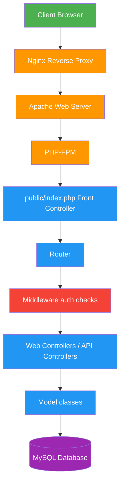
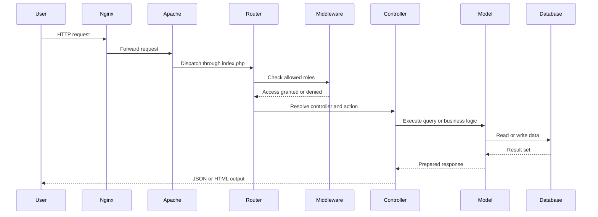
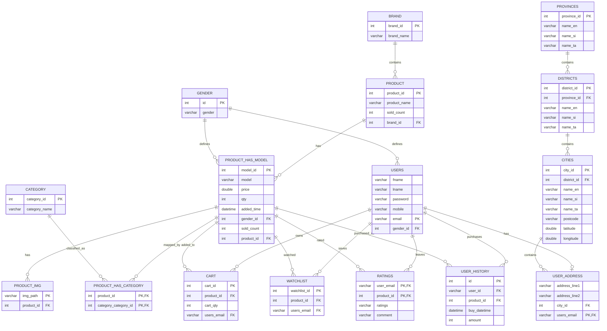

<p align="center">
  <h1 align="center">🛒 TimeStore</h1>
  <p align="center">
    A custom PHP e-commerce platform built with MVC architecture, a front controller, and a custom routing system.
  </p>
</p>

<p align="center">


</p>

---

# 🌐 Live Demo

Demo URL  https://timestore.imeshvishmika.me


---

# 📖 Project Overview

**TimeStore** is a PHP-based e-commerce application built around a custom MVC flow with a front controller and route configuration in `Router.php`. The project uses direct controller-to-model access, server-side validation, session-based auth, and a MySQL schema for product, customer, cart, order, and address data.

The application supports storefront browsing, product model management, user accounts, cart and wishlist operations, and admin-side dashboards for product and customer administration. The architecture is intentionally lightweight and code-driven rather than framework-based, which matches the project’s actual implementation and naming patterns.

---

# ⭐ Features

## 👤 User Features

- Browse the product catalog and product variants
- Search products by keyword and filter by product model data
- Add and remove items from the cart
- Save items in a watchlist
- View purchase history and user profile details
- Update personal address information
- Place orders with the **PayHere sandbox payment gateway**
- View and exchange messages with administrators

---

## 🛠 Admin Features

- Add and update product entries and model variants
- Remove products and product records
- View product revenue and sales statistics
- Manage users and customer details
- Review order records and order status
- Manage brand and category records
- Review message activity between users and admins

---

# 🧰 Technology Stack

| Layer | Implementation |
|------|------|
| Backend | PHP 8.x |
| Architecture | MVC with a front controller |
| Routing | Custom route map in `Router.php` |
| Auth | Session-based role checks via middleware |
| Data access | Model classes under `app/model` |
| Database | MySQL |
| Web server | Apache / PHP-FPM |
| Reverse proxy | Nginx |
| Payment | PayHere sandbox |
| Front-end assets | Plain PHP views and static files under `public/assets` |

---

# 🏗 System Architecture


---

# 🔄 Request Lifecycle


---

# 🗄 Database Design

The application database is modeled to match the current MySQL schema in the project dump. The main entities are brands, products, product variants, users, addresses, carts, watchlists, and purchase history.



Core schema tables:

- `brand`: watch brands such as G-Shock
- `product`: base product row for each item family
- `product_has_model`: product variants/models with price, stock, gender, and sold count
- `category` + `product_has_category`: many-to-many mapping between product models and categories
- `product_img`: image paths associated with each product model
- `users`: registered customer accounts
- `user_address`: customer shipping address linked to a city
- `provinces`, `districts`, `cities`: Sri Lankan location hierarchy used for addresses
- `cart`: items currently in a user’s cart
- `watchlist`: saved products for later viewing
- `ratings`: product ratings and comments left by users
- `user_history`: product purchase history for each user

---

# 🔐 Security

The project applies security checks at the routing layer before reaching controller logic. Route definitions in `Router.php` can specify required roles such as `admin` or `user`, and the auth middleware validates that session state before dispatch.

Current implementation details:

- Session-based authentication using the auth middleware
- Role-based route restrictions through `allows` entries
- Controller access controlled before action execution
- Payment flows and sensitive endpoints restricted by role checks

This is a lightweight backend security model rather than a full framework middleware stack, which matches the project’s actual implementation.

---

# 📁 Project Structure

```text
timestore/
├── app/
│   ├── controllers/
│   │   ├── Api/
│   │   │   ├── BrandController.php
│   │   │   ├── CartController.php
│   │   │   ├── DeliveryMethodController.php
│   │   │   ├── HistoryController.php
│   │   │   ├── MessageController.php
│   │   │   ├── OrderController.php
│   │   │   ├── ProductController.php
│   │   │   ├── SearchController.php
│   │   │   ├── UserController.php
│   │   │   └── WishlistController.php
│   │   └── Web/
│   │       ├── AdminPageController.php
│   │       ├── ImgController.php
│   │       └── UserPageController.php
│   ├── core/
│   │   ├── Router.php
│   │   └── Validator.php
│   ├── middleware/
│   │   └── auth.php
│   ├── model/
│   │   ├── admin.php
│   │   ├── brand.php
│   │   ├── cart.php
│   │   ├── customers.php
│   │   ├── delivery.php
│   │   ├── history.php
│   │   ├── Img.php
│   │   ├── messages.php
│   │   ├── orders.php
│   │   ├── product.php
│   │   ├── search.php
│   │   └── wishlist.php
│   └── views/
│       ├── Admin/
│       └── User/
├── config/
│   ├── connection.php
│   └── payhere.php
├── public/
│   ├── index.php
│   ├── loadImg.php
│   └── assets/
│       ├── Script/
│       └── style/
├── media/
│   ├── icons/
│   ├── poster/
│   ├── product/
│   └── userprofile/
├── README.md
├── SECURITY_AUDIT_REPORT.md
└── Dockerfile
```
